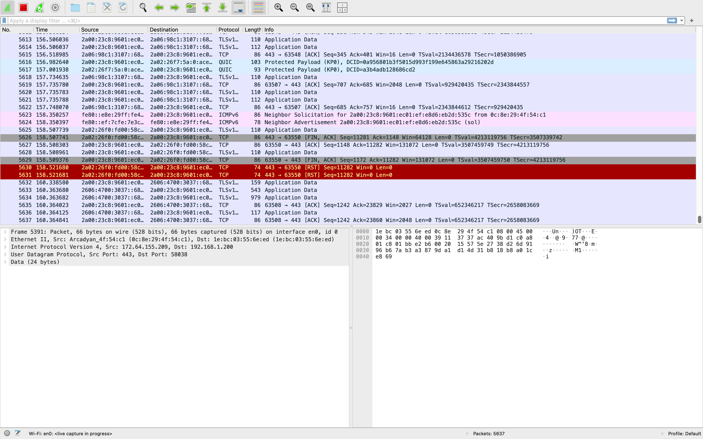
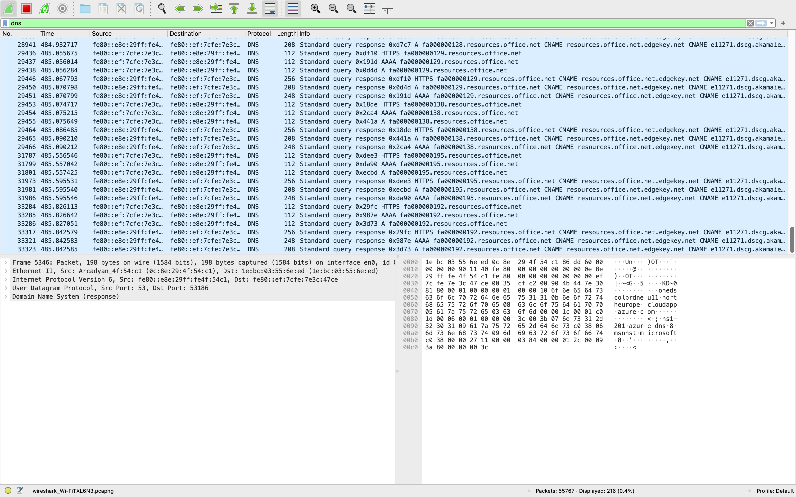

# Wireshark Network Traffic Analysis

## Objective

To analyse captured network traffic and identify suspicious or potentially malicious activity.

---

## Tools Used

* Wireshark

---

## Methodology

* Captured network traffic using Wireshark
* Applied filters to isolate relevant protocols (DNS, HTTP, TCP)
* Analysed packet details including source and destination IP addresses
* Reviewed traffic patterns and communication behaviour

---

## Analysis & Findings

During the analysis, the following observations were made:

* Repeated DNS queries to external domains
* Multiple HTTP requests to unknown or unverified servers
* Unusual traffic patterns that may indicate suspicious behaviour
* Potential indicators of abnormal network communication

---

## Conclusion

This project demonstrates how packet-level analysis can be used to identify potential security threats. Monitoring and analysing network traffic is a key skill in Security Operations Centre (SOC) environments.

---

## Skills Developed

* Network traffic analysis
* Packet inspection
* Threat identification
* Use of Wireshark for monitoring
## Evidence

### Packet Capture Overview

### DNS Traffic Analysis

